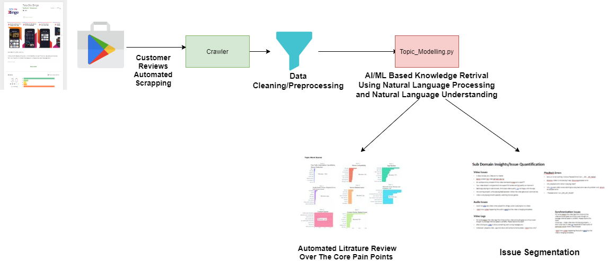

# PlayStoreReviewsAnalytics

**Requirements**

    Python3.7
    pip install requirements.txt

# Run Code [COLAB LINK](https://colab.research.google.com/drive/18bNU8SmolICvEZExZIurBvxXln1f1tBO?invite=CLqgwM0D#scrollTo=wd09sNiPEScM)

- Run Code Without Installations Requirements
- Interactive .ipynb Python Notebook For Results

# Overview

Flow Diagram

> - Playstore_reviews_scrapper.py

  Fetch Reviews And MetaData(reviewID,userName,rating,content,thumbsUpCount,timestamp)  From Playstore and Saves the result

> - Topic_Modelling.py

Uses the extracted reviews and performs

1) Text Cleaning: Clean the text reviews containing . Hindi Text, Emoji's,Icon

2) Apply Transformer Based Deeplearning NLP Model For Topic Modelling

3) Outputs the extracted topics and saves the Interactive Visual Graphs to

        ./Visual_Outputs/InterTopicsDistance.html
        
        ./Visual_Outputs/TopicsTrendOverTime.html
        
        ./Visual_Outputs/TopicsBarChart.html
        
        ./Visual_Outputs/hirarchicalSegmentation.html
        
        ./Visual_Outputs/topicsHeatmap.html
        
        ./Visual_Outputs/topicRank.html
       

# Run Code

We can Run the code in the browser

[COLAB LINK](https://colab.research.google.com/drive/18bNU8SmolICvEZExZIurBvxXln1f1tBO?invite=CLqgwM0D#scrollTo=wd09sNiPEScM)

Don't Requires Installation And DOwnloading